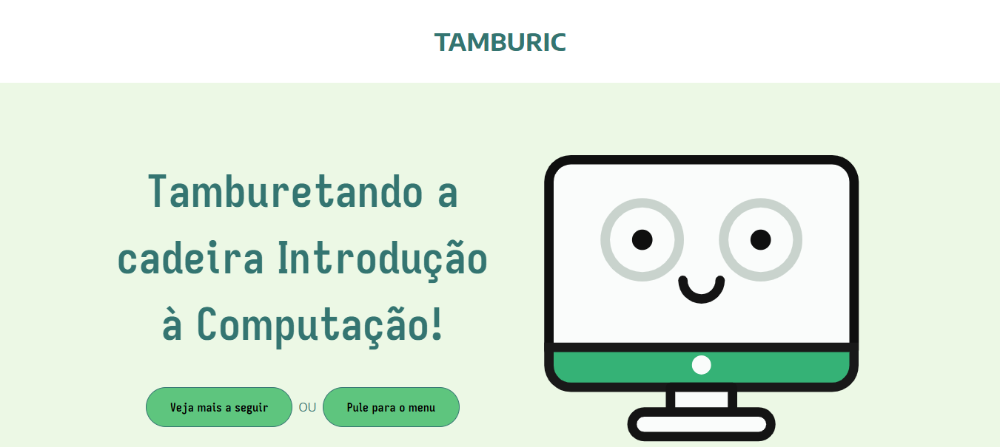

# TAMBURIC

> O projeto tem a proposta de auxiliar aqueles que pagam a matéria de Introdução à Computação! Assim, ele reune ferramentas e conhecimentos que auxiliam a "tamburetar" a disciplina.

### Ajustes e melhorias

O projeto ainda está em desenvolvimento e as próximas atualizações serão voltadas para as seguintes tarefas:

- [x] Conversor de bases
- [ ] https://github.com/SEMZluis/ic-ufcg/issues/15
- [ ] https://github.com/SEMZluis/ic-ufcg/issues/16

## ☕ Usando o TAMBURIC
Para usar TAMBURIC, basta navegar pelo site através do [link](https://ic-ufcg.vercel.app/) e explorar suas funcionalidades! 